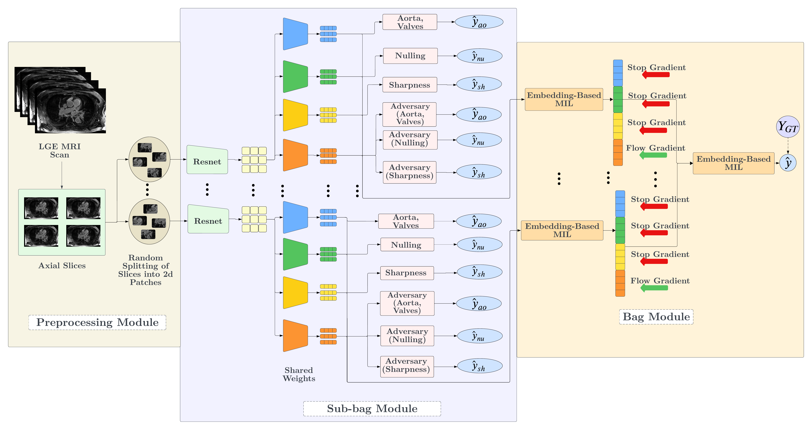

# AC-MIL

**Weakly Supervised Atrial LGE-MRI Quality Assessment via Adversarial Concept Disentanglement**

[](https://arxiv.org/abs/2604.10303)
[](LICENSE)

K M Arefeen Sultan, Kaysen Hansen, Benjamin Orkild, Alan Morris, Eugene Kholmovski, Erik Bieging, Eugene Kwan, Ravi Ranjan, Ed DiBella, Shireen Elhabian



## Overview

Late Gadolinium Enhancement (LGE) MRI quality assessment is usually framed as a single opaque score, which gives clinicians no way to tell *why* a scan was flagged. AC-MIL instead decomposes overall scan quality into clinically defined radiological concepts — **sharpness**, **myocardium nulling**, and **aorta/valve enhancement** — while training an *unsupervised* residual concept adversarially so it cannot leak information already captured by the supervised ones.

The model is a two-tier attention-based Multiple Instance Learning (MIL) network:

1. **Sub-bag module** — axial slices are split into random pseudo-bags of 2D patches; a shared ResNet encoder feeds four concept-specific attention branches (sharpness, nulling, aorta/valve, and the adversarially-trained unsupervised concept). A gradient-reversal layer (GRL) drives the unsupervised branch to be uninformative about the three supervised concepts, and a spatial-diversity loss discourages different concepts from attending to the same patches.
2. **Bag module** — pseudo-bag embeddings are aggregated by a second attention-MIL layer into a volume-level ordinal quality grade, trained with a CORN ordinal loss.

This repository contains the training/evaluation pipeline for that model (`AttentionMILPseudoBagTier1Unsup` + `AttentionMILPseudoBagTier2Unsup` in `model.py`).

## Repository structure

```
config.py                          Model/training hyperparameters and paths
run_hamilqa_unsup.py                Entry point: k-fold train + evaluate
model.py                            Tier-1 (sub-bag) and Tier-2 (bag) networks
scripts/
  hamilqa_unsup_trainer.py          Trainer: train/val/test loops, losses, metrics
  qc_dataset.py                     Builds patient records from the QC label JSON
  corn_utils.py, losses.py          CORN ordinal loss and rank-to-label utilities
util/
  mil_utils.py                      MONAI transform pipelines (pseudo-bag construction)
  data_utils.py                     NRRD loading, axial-slice extraction, patch cropping
  volume_preprocessing.py           Deterministic pre-caching transform
  early_stopping.py, metrics.py     Early stopping and ordinal agreement metrics
```

## Setup

```bash
conda env create -f environment.yml
conda activate lge_mri_qc
```

A CUDA-capable GPU is expected; `config.py`'s `gpu_id` selects which device to use.

If you log to [Comet ML](https://www.comet.com/), create a `.env` file in the repo root with:

```
COMET_API_KEY=your_api_key_here
```

Set `disable_comet = True` in `config.py` to run without an internet connection or API key.

## Data preparation

The dataset itself is not distributed with this repository. `run_hamilqa_unsup.py` expects:

1. **A patient-scan directory**, one subfolder per scan, each containing:
   - `data.nrrd` — the 3D LGE-MRI volume
   - `shrinkwrap.nrrd` — the left-atrium binary segmentation mask, same grid as `data.nrrd`
2. **A quality-control label JSON**, keyed by scan folder name, e.g.:

```json
{
  "Patient_ID": {
    "label": {
      "quality_for_fibrosis_assessment": 3,
      "sharpness": 2,
      "myocardium_nulling": 3,
      "enhancement_of_aorta_and_valves": 4
    },
    "segmented_region_indices": "ok"
  }
}
```

  Quality ratings are 1-4 (converted internally to 0-3 ordinal classes). Scans missing any of the three concept labels are skipped, since this model is trained jointly on all three.

Point `config.py` at your data by editing:

```python
_DATASET_ROOT = "/path/to/your/dataset"   # near the top of config.py
# expects: {_DATASET_ROOT}/afib_db/<scan_folders>/
#          {_DATASET_ROOT}/new_surface_area_with_ratings.json
```

## Configuration

Key knobs live in `config.py` under `config["AFibQCAttentionMILPsuedoBagsUnsupervisedNet2D"]`:

| Key | Meaning |
|---|---|
| `no_of_pseudo_bags` | Pseudo-bags sampled per scan (default 4) |
| `n_patches` | 2D patches sampled per scan across all pseudo-bags (default 60) |
| `patch_size_2d` | Patch size in pixels (default 64x64) |
| `lambda_adv` | Weight on the adversarial (GRL) loss |
| `lambda_div` | Weight on the spatial-diversity loss between concept attention maps |
| `lambda_concepts` | Weight on the concept-supervision loss |
| `min_la_slices` | Skip scans with fewer than this many LA-containing axial slices |
| `batch_size`, `epochs`, `learning_rate`, `weight_decay` | Standard training hyperparameters |
| `model_path` | Where fold checkpoints are saved (default `model/saved_models`) |

## Training & evaluation

Checkpoint directory (not created automatically):

```bash
mkdir -p model/saved_models
```

```bash
python run_hamilqa_unsup.py \
  --learning_rate 1e-4 \
  --no_of_pseudo_bags 4 \
  --n_patches 60 \
  --min_la_slices 8 \
  --seed 0
```

This runs stratified k-fold cross-validation (set via `config["..."]["k_folds"]`, defaults to 10 if unset). For each fold it:
1. Trains Tier-1 + Tier-2 jointly with early stopping on validation QWK, saving the best checkpoint pair to `model_path`.
2. Reloads the best checkpoints and evaluates on the held-out test split (ordinal QWK, one-off accuracy, AMAE, Scott's Pi, adversarial-entropy diagnostics).
3. Logs metrics, hyperparameters, and per-fold notifications to Comet ML (unless `disable_comet = True`).

Averaged metrics across all folds are printed and logged at the end of the run.

## Citation

```bibtex
@article{sultan2026ac,
  title={AC-MIL: Weakly Supervised Atrial LGE-MRI Quality Assessment via Adversarial Concept Disentanglement},
  author={Sultan, KM and Hansen, Kaysen and Orkild, Benjamin and Morris, Alan and Kholmovski, Eugene and Bieging, Erik and Kwan, Eugene and Ranjan, Ravi and DiBella, Ed and Elhabian, Shireen},
  journal={arXiv preprint arXiv:2604.10303},
  year={2026}
}
```

## License

MIT — see [LICENSE](LICENSE).
